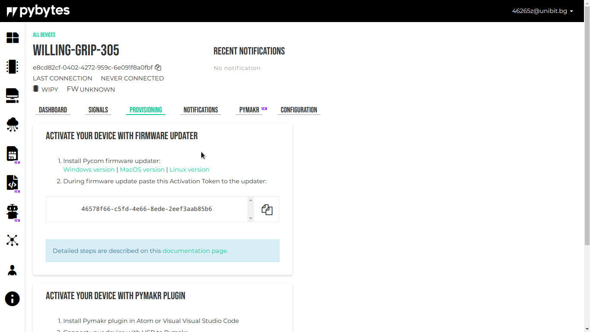

# add device

Za da sledvate stupkite trqbva da imate registraciq v pybytes.

1. ADD WIFI

Zadavame mreja kym koqto da se svyrje platkata pri vkluchvane, nai-chesto mrejata kym koqto e svyrzan laptopa vi.

2. ADD DEVICE

Suzdavame novo ustroistvo kato po vreme na procesa izbirame mrejata koqto sme suzdali v stupka 1. Kopiraite koda za aktivirane.

3. FLASH DEVICE

Vkluchvame ustroistvoto kym PC i startirame _PyCom Firmware Update Tool_, vajno e versiqta na programata da e poslednata nalichna (snimka 3.1.) 

[^3.1.]: check for latest version

**Otmetnete opciqta Force update pybytes registration**

Activation token-a e koda koito kopirahme ot saita sled kato suzdadohme ustroistvoto. (snimka 3.2.)

[^3.2.]: device activation/registration

Ako vsichko e nared stoinostta na poleto _last connection_ trqbva da se promeni ot _never connected_ na _few seconds ago