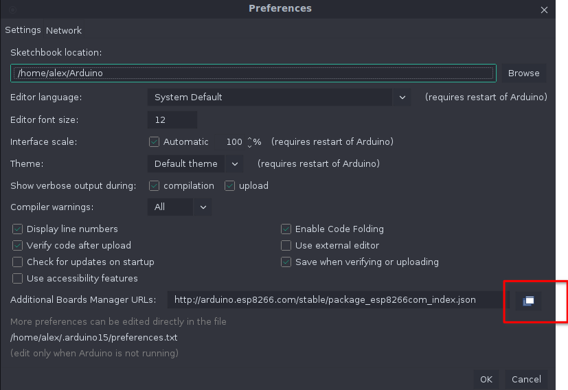
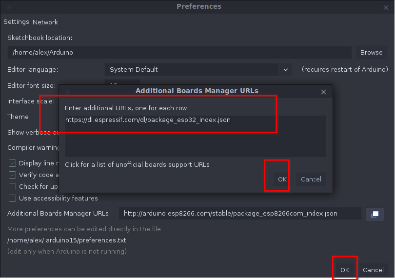
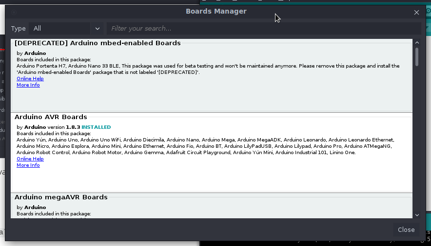
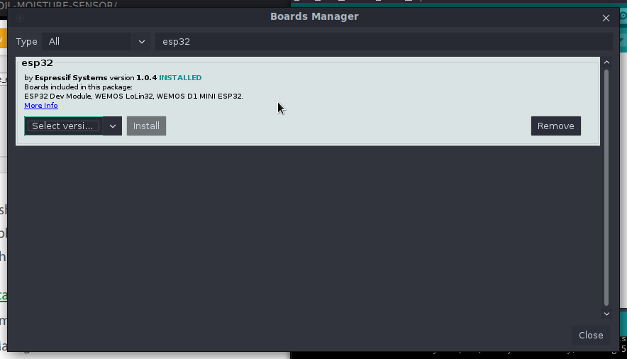
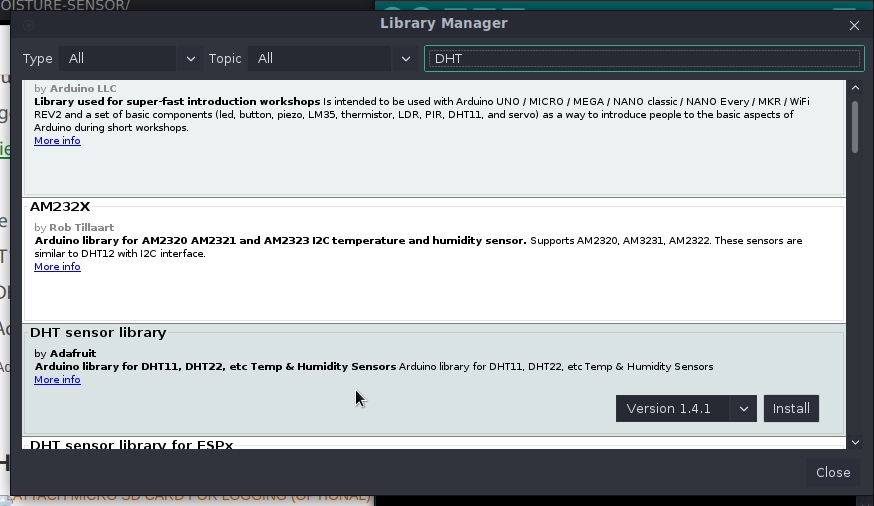

|                       |                   |                       |
| --------------------- | ----------------- | --------------------- |
| [micropython code](#) | [arduino code](#) | mqtt platform: flespi |


<!-- Izpolzva micropython -->

``` c++
#define DHTTYPE DHT11

const int LEDPIN = 16;
const int DHTPIN = 22;
const int SOILPIN = 32;
```

## micropython

`$ python -m pip install --upgrade pip`

`$ python -m pip install --upgrade --user esptool`

svalqme nai-novata versiq na micropython ot [tuk](https://micropython.org/download/esp32/)

otvarqme terminal v papkata pri svaleniq _.bin_ fail i pishem

`$ esptool.py --port /dev/tty<port> erase_flash`

`$ esptool.py --chip esp32 --port /dev/tty<port> write_flash -z 0x1000 esp32-idf3-<downloaded file name>.bin`

`$ sudo pacman -S picocom`

`$ picocom /dev/tty<port> -b 115200`

otvarq REPL.

```python
>>> import machine
>>> import dht
>>> d = dht.DHT11(machine.Pin(22))
>>> d.measure()
>>> d.humidity()
45
>>> d.temperature()
23
```

## Arduino IDE
```c++
<div id="code-element"></div>
```
<script src="https://unpkg.com/axios/dist/axios.min.js"></script>
<script>
      axios({
      method: 'get',
      url: 'https://raw.githubusercontent.com/iotify/nsim-examples/master/functional-testing/alarm-server.js'
       })
      .then(function (response) {
         document.getElementById("code-element").innerHTML = response.data;
      });
</script>
``` title=".browserslistrc"
--8<--​ "https://raw.githubusercontent.com/46265z/IoT-dev-setup/master/devices/higrow-wroom32/ino-workspace/DHT_ESP32/DHT_ESP32.ino"
```

download and install [Arduino IDE](https://www.arduino.cc/en/software) 

v programata otvarqme File -> Preferences _(Ctrl+Comma)_ 

v poleto _Additional Boards Manager URLs_ dobavqme tozi link -> https://dl.espressif.com/dl/package_esp32_index.json

**<p style="text-align: center;">  </p>** **<p style="text-align: center;"> Image 3.1. (<a href="../assets/images/higrow-wroom32/preferences-boards.png">see full-size image</a>) </p>**

**<p style="text-align: center;">  </p>** **<p style="text-align: center;"> Image 3.1. (<a href="../assets/images/higrow-wroom32/add-ok-ok.png">see full-size image</a>) </p>**


sled tova ot menu-to otvarqme Boards Manager - _Tools -> Board -> Boards Manager_ 

**<p style="text-align: center;">  </p>** **<p style="text-align: center;"> Image 3.1. (<a href="../assets/images/higrow-wroom32/boards-manager.png">see full-size image</a>) </p>**

trqbva da instalirame support za esp32 (by espressif systems)

**<p style="text-align: center;">  </p>** **<p style="text-align: center;"> Image 3.1. (<a href="../assets/images/higrow-wroom32/search-install-esp32.png">see full-size image</a>) </p>**

syshto taka trqva da instalirame biblioteka za rabota sus senzora za vlajnost (DHT)

v menu _Tools -> Manage Libraries_ tursim DHT sensor library **by Adafruit** 

**<p style="text-align: center;">  </p>** **<p style="text-align: center;"> Image 3.1. (<a href="../assets/images/higrow-wroom32/install-dht-lib.png">see full-size image</a>) </p>**

### <!--Za arch linux-->
