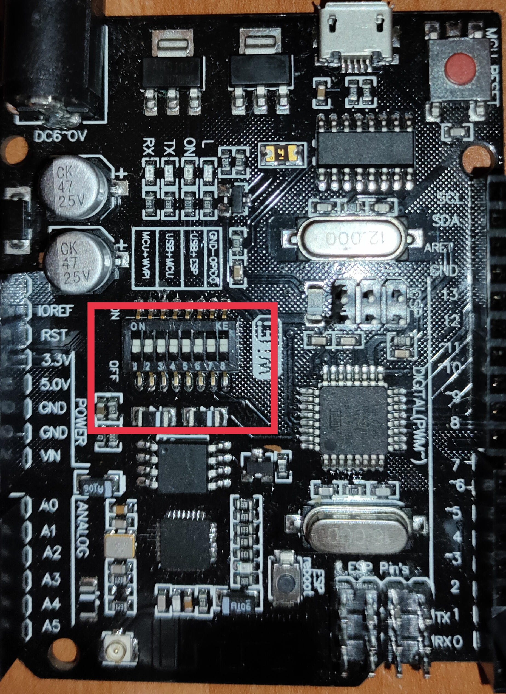

# atmega328p (Arduno UNO) + esp8266EX (WIFI)

|                       |                              |                       |
| --------------------- | ---------------------------- | --------------------- |
| [micropython code](#) | [arduino code](#arduino-ide) | mqtt platform: flespi |

It is a customized version of the classic ARDUINO UNO R3 board. Full integration of microcontroller Atmel ATmega328 and IC Wi-Fi ESP8266 with 32 MB (__Нашето е с 8мб__) flash memory, and USB-TTL converter CH340G (__на Linux 5.10.23-1-MANJARO го показва като *QinHeng Electronics CH340 serial converter*__)on one board. All modules can work together or independently.

On the board where the switch of mode of operation with 8 position

**
  
** **
 суичове (<a href="../../assets/images/uno_wifi/eight_switch.jpg">see full-size image</a>) 
**

To communicate between Arduino and ESP you will need to activate deep switches 1 and 2.
To upload a sketch on ESP: 5, 6, 7. (source code in [uno_wifi/ino-workspace](https://github.com/46265z/IoT-dev-setup/tree/main/devices/uno_wifi/ino-workspace) )
To upload on Arduino: 3, 4. ()
**Don't forget to change board options before uploading when switching.**

To see what is transferred to ESP from Arduino: 1, 2, 3, 4.
To see what is transferred to Arduino from ESP: 1, 2, 5, 6.
(by opening serial terminal)

## ArduinoIDE

### atmega328p code

