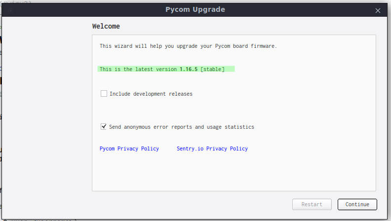

# hw init 

# <!--Setup device-->

<!--Za da sledvate stupkite trqbva da imate registraciq v pybytes.-->

## <!--ADD WIFI-->

<!--Zadavame mreja kym koqto da se svyrje platkata pri vkluchvane, nai-chesto mrejata kym koqto e svyrzan laptopa vi.-->

## <!--ADD DEVICE-->

<!--Suzdavame novo ustroistvo kato po vreme na procesa izbirame mrejata koqto sme suzdali v stupka 1. Kopiraite koda za aktivirane.-->

<!--<!-- **
  
** **
 Image 3.1. (<a href="/img/ref-token.png">see full-size image</a>) 
** -->-->

## <!--FLASH DEVICE-->

<!--Vkluchvame ustroistvoto kym PC i startirame _PyCom Firmware Update Tool_, vajno e versiqta na programata da e poslednata nalichna (snimka 3.1.)--> 

<!--**
  
** **
 Image 3.1. (<a href="../assets/images/pycomflasher.png">see full-size image</a>) 
**-->

<!--**Otmetnete opciqta Force update pybytes registration**-->

<!--Activation token-a e koda koito kopirahme ot saita sled kato suzdadohme ustroistvoto. (snimka 3.2.)-->

<!--**
  
** **
 Image 3.2. (<a href="../assets/images/pycomflasher.png">see full-size image</a>) 
**-->

<!--Ako vsichko e nared stoinostta na poleto _last connection_ trqbva da se promeni ot _never connected_ na _few seconds ago-->